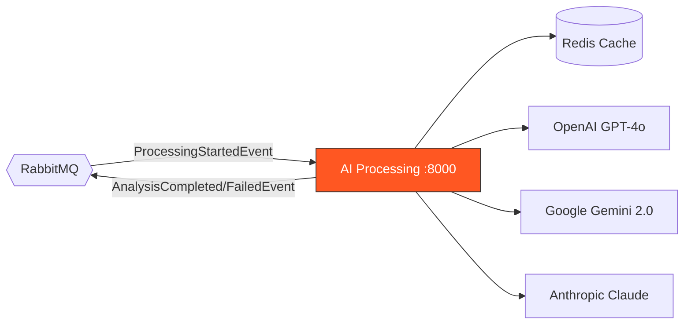
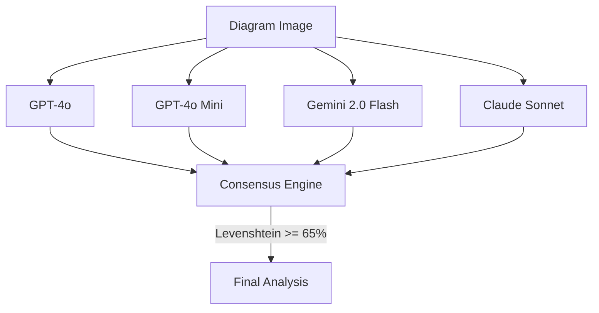

# :brain: ArchLens AI Processing

Multi-provider AI analysis engine with consensus voting and guardrails for architecture diagram evaluation.

## Architecture Overview



## Consensus Engine



## Tech Stack

| Technology | Purpose |
|---|---|
| Python 3.11+ | Runtime |
| FastAPI | HTTP framework |
| Hexagonal Architecture | Project structure |
| Redis | Cache by file hash |
| Levenshtein matching | Fuzzy consensus (65% threshold) |
| Guardrails | Input/output validation |

## API Endpoints

| Method | Endpoint | Auth | Description |
|---|---|---|---|
| `GET` | `/api/health` | No | Health check |
| `POST` | `/api/analyze` | Yes | Submit diagram for AI analysis |
| `POST` | `/api/chat` | Yes | Chat about an analysis |

## AI Providers

| Provider | Model |
|---|---|
| OpenAI | GPT-4o, GPT-4o Mini |
| Google | Gemini 2.0 Flash |
| Anthropic | Claude Sonnet |

## Running

```bash
pip install -r requirements.txt
uvicorn app.main:app --host 0.0.0.0 --port 8000
```

The service starts on **port 8000**.

## Environment Variables

| Variable | Description | Default |
|---|---|---|
| `OPENAI_API_KEY` | OpenAI API key | — |
| `GOOGLE_API_KEY` | Google Gemini API key | — |
| `ANTHROPIC_API_KEY` | Anthropic API key | — |
| `REDIS_URL` | Redis connection URL | `redis://localhost:6379` |
| `RABBITMQ_HOST` | RabbitMQ host | `localhost` |

## Events

- **Consumes:** `ProcessingStartedEvent`
- **Publishes:** `AnalysisCompletedEvent`, `AnalysisFailedEvent`
